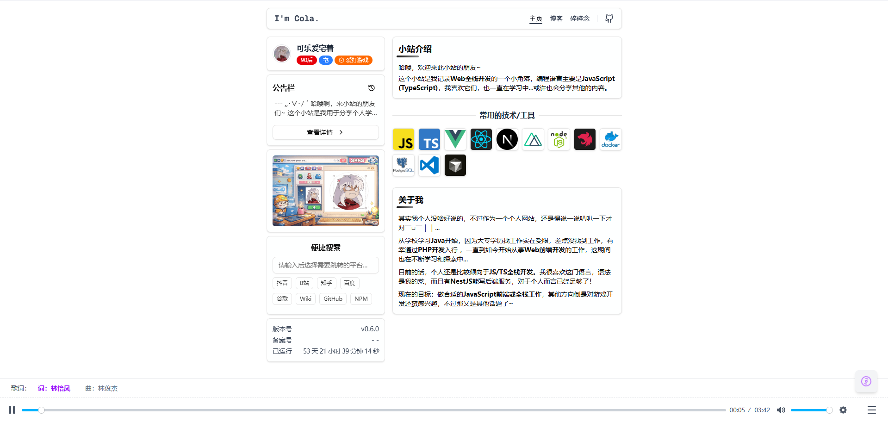

# I'm Cola

个人小站，用于分享学习与生活，技术栈以 JavaScript / TypeScript 为主，包含博客、碎碎念、公告栏等模块，并集成底部音乐播放器与歌词展示。

## 封面预览

| 手机端                                      | Web 端                                  |
| ------------------------------------------- | --------------------------------------- |
|  |  |

- **手机端**：`public/imgs/mobile-cover.png` — 移动端首页布局与底部播放器（歌词一行展示）。
- **Web 端**：`public/imgs/pc-cover.png` — 桌面端首页布局与底部播放器（歌词两句展示）。

---

## 项目介绍

基于 Next.js 的个人站，支持博客、日常碎碎念、公告栏与底部音乐播放器（含 WebVTT 歌词）。内容通过 `content-collections` 从 `contents/` 目录按约定格式读取，歌曲列表与歌词在配置与 `public/audio` 中维护。

## 下载与安装

```bash
git clone <仓库地址>
cd me
npm install
```

## 本地运行

```bash
npm dev
```

浏览器访问 [http://localhost:3596](http://localhost:3596)。如需生产构建与启动：

```bash
npm build
npm start
```

## 内容管理

### 博客

- **路径**：`contents/posts/YYYY-MM/post-xx-标题.mdx`
- **Frontmatter**：`title`、`summary`、`date`（如 `2026/01/12 21:35`）、`tags`（字符串数组）
- 正文为 MDX，支持 GFM 与代码高亮。

示例：

```yaml
---
title: 文章标题
summary: 摘要
date: 2026/01/12 21:35
tags:
  - next.js
  - node.js
---
正文...
```

### 日常碎碎念

- **路径**：`contents/daily/YYYY-MM/daily-MM-dd.mdx`
- **Frontmatter**：`title`、`weather`、`date`（如 `2026-03-05 17:05`）
- 正文为 MDX。

示例：

```yaml
---
title: 一条碎碎念的标题
weather: 晴
date: 2026-03-05 17:05
---
<div className="...">内容...</div>
```

### 公告

- **路径**：`contents/notices/任意名称.md`
- **Frontmatter**：`title`、`date`、`priority`（可选：`low` | `medium` | `normal` | `high`，默认 `normal`）、`tags`（可选）
- 正文为 Markdown，会编译为 HTML 展示。

示例：

```yaml
---
title: '小站公告'
date: '2026-01-25'
priority: 'normal'
tags: ['简介']
---
公告正文...
```

### 添加歌曲

1. **播放列表**：在 `config/audio.ts` 的 `AUDIO_PLAYLIST` 中追加一项：
   - `title`：歌名（列表显示）
   - `src`：音频文件 URL（站内可放 `public/audio/xxx.mp3` 后写 `/audio/xxx.mp3`）
   - `vtt`（可选）：歌词文件 URL，需为 **WebVTT** 格式（`.vtt`）。若为 LRC，需先转为 WebVTT。

2. **歌词文件**：将 `.vtt` 放到 `public/audio/`，例如 `public/audio/我的歌.vtt`，配置里写 `vtt: '/audio/我的歌.vtt'`。

示例（`config/audio.ts`）：

```ts
{
  title: '歌名',
  src: '/audio/我的歌.mp3',           // 或完整 CDN/外链 URL
  vtt: '/audio/我的歌.vtt',           // 可选，有则底部显示歌词
}
```
